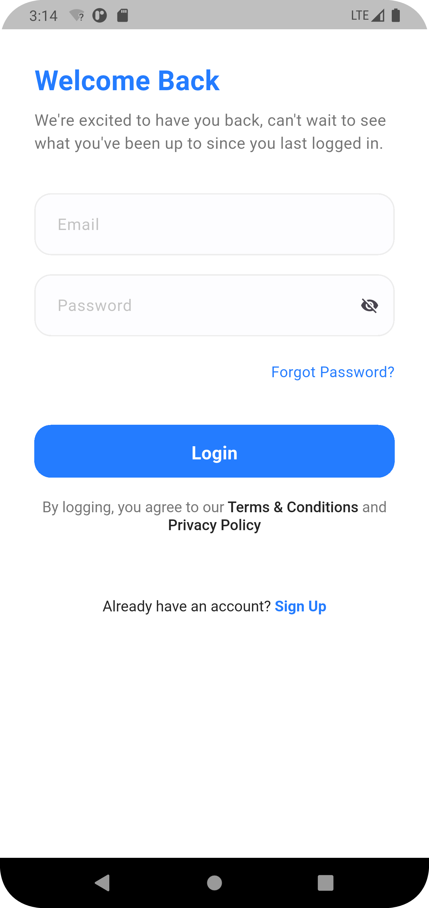

# Flutter Doctor Appointment App 🩺

A modern, full-featured **Doctor Appointment Booking App** built with Flutter. This project enables users to browse doctors by specialty, view doctor profiles, book appointments, and manage their medical interactions efficiently. It combines a sleek UI with essential functionalities that are ideal for telemedicine startups, hospitals, or independent healthcare professionals.

The project demonstrates best practices in Flutter development, including modular architecture, state management with BLoC and Cubit, REST API integration with Dio and Retrofit, dependency injection using GetIt, and support for localization and theming. With persistent storage, real-time updates, and rich UI elements such as shimmer effects and SVG graphics, the app delivers a seamless user experience across Android, iOS, and web platforms.

## 📸 Screenshots

| Splash                               | On Boarding                                | Login                                      | Booking                                    |
| ------------------------------------ | ------------------------------------------ | ------------------------------------------ | ------------------------------------------ |
|   |      |           |              |

| Home                                 | Doctor List                                | Profile                                    | Booking                                    |
| ------------------------------------ | ------------------------------------------ | ------------------------------------------ | ------------------------------------------ |
|  |  |  |  |

## 📱 Features

- **Book appointments with doctors**
- **User authentication and secure storage**
- **Beautiful, responsive UI**
- **Localization (multi-language support)**
- **Persistent storage and caching**
- **Splash screens, shimmer effects, and SVG support**
- **Clean code with BLoC/Cubit state management**
- **REST API integration using Dio & Retrofit**
- **Dependency injection with GetIt**
- **Ready for Android, iOS, Web, macOS, Linux**

## 📦 Tech Stack

- **Flutter** (Dart 3.8+)
- **State Management:** flutter_bloc, freezed
- **Networking:** dio, retrofit, pretty_dio_logger
- **Dependency Injection:** get_it
- **Localization:** intl, easy_localization
- **Persistence:** shared_preferences, flutter_secure_storage, cached_network_image
- **UI:** shimmer, shimmer_animation, flutter_svg, flutter_screenutil
- **Firebase:** firebase_core

## 🚀 Getting Started

### Prerequisites

- Flutter SDK 3.8.1 or higher
- Dart SDK
- Android Studio/Xcode/VS Code
- (Optional) Firebase project setup for cloud features

### Installation

1. **Clone the repository:**
   ```bash
   git clone https://github.com/TareqAlKushari/Flutter-Doctor-Appointment-App.git
   cd Flutter-Doctor-Appointment-App
   ```

2. **Install dependencies:**
   ```bash
   flutter pub get
   ```

3. **Run code generation (if needed):**
   ```bash
   flutter pub run build_runner build --delete-conflicting-outputs
   ```

4. **Configure assets:**
   - Place your images in `assets/images/`
   - Place your SVGs in `assets/svgs/`
   - Update `pubspec.yaml` if you add other asset folders

5. **Run the app:**
   ```bash
   flutter run
   ```

### 🧾 Project Structure

- `lib/main.dart` — App entry point
- `lib/doc_app.dart` — Main app widget and routing
- `lib/core/` — Core utilities, themes, shared components
- `lib/features/` — Feature modules (authentication, booking, profile, etc.)
- `assets/` — Images and SVGs
- Platform folders: `android/`, `ios/`, `web/`, `macos/`, `linux/`

### Configuration

- **Localization:** Edit assets under the localization section in `pubspec.yaml`.
- **Splash Screen:** Edit `flutter_native_splash.yaml` and run `flutter pub run flutter_native_splash:create`.

## Scripts

- **Test:** `flutter test`
- **Lint:** `flutter analyze`

## Acknowledgements

- [Flutter](https://flutter.dev/)
- [Bloc](https://bloclibrary.dev/#/)
- [Dio](https://pub.dev/packages/dio)
- [Easy Localization](https://pub.dev/packages/easy_localization)
- [Firebase](https://firebase.flutter.dev/)

## 🤝 Contributing

Pull requests are welcome! For major changes, please open an issue first to discuss what you would like to change.

## 📜 License

This project is open-source and available under the [MIT License](LICENSE).

## 🙋‍♂️ Author

**Tareq Al-Kushari**   [GitHub](https://github.com/TareqAlKushari) • [LinkedIn](https://www.linkedin.com/) • [Facebook](https://www.facebook.com/profile.php?id=61562736475116&mibextid=ZbWKwL) • [Instagram](https://www.instagram.com/tareq.al.kushari?igsh=MTBhZjRuYnFoMWw1YQ==) • [X](https://x.com/Al_Kushari?t=gU61bcmlDbtf3KV4kqGULA&s=09) • [Email](mailto:tareq.al.kushari@gmail.com) • [Portfolio Website](#)

> If you found this helpful, don't forget to **star** the repo and share it with others! ⭐
